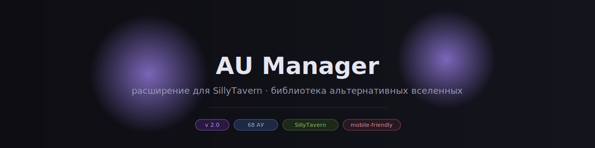

<div align="center">

**Расширение для SillyTavern — менеджер альтернативных вселенных**

[Что это](#-что-это) · [Установка](#-установка) · [Как пользоваться](#-как-пользоваться) · [Библиотека АУ](#-библиотека-ау) · [Свои АУ](#-свои-ау) · [Импорт и экспорт](#-импорт-и-экспорт)

</div>

---

## 🎭 Что это

**AU Manager** — расширение для SillyTavern, которое позволяет подключать к ролевой игре готовые правила альтернативных вселенных (АУ).

Каждое АУ — это компактный промт (200–300 токенов), который автоматически вставляется в каждый запрос к ИИ и задаёт правила мира: биологию, социальные структуры, магические системы, атмосферу сеттинга. Включил — и модель сразу понимает, что значит омегаверс, как работают фэйри, что такое ханахаки или звериный регресс.

**68 встроенных АУ** в 6 категориях. Можно включить несколько одновременно.

---

## 📦 Установка

### Вариант 1 — через интерфейс SillyTavern

1. Открой **Extensions → Install Extension**
2. Вставь ссылку на репозиторий:
   ```
   https://github.com/KiskaSora/au-manager.git
   ```
3. Нажми **Install** → расширение появится в меню Extensions

### Вариант 2 — вручную

```bash
# Перейди в папку расширений SillyTavern
cd SillyTavern/public/scripts/extensions/third-party

# Клонируй репозиторий
git clone https://github.com/KiskaSora/au-manager
```

Перезапусти SillyTavern. Расширение появится в меню расширений.

---

## 🕹 Как пользоваться

### Открыть менеджер

Нажми кнопку **🎭** в панели расширений SillyTavern (вверху страницы).

### Интерфейс

```

```

### Включить АУ

Нажми на карточку — она подсветится. Промт будет автоматически добавляться к каждому сообщению. Можно включить несколько АУ одновременно — они складываются.

### Переключатель инъекции

Тумблер **«инъекция»** в шапке — глобальный выключатель. Выключи, чтобы временно убрать все АУ, не снимая галочки с карточек.

### Счётчик токенов

Под карточками показывается суммарное количество токенов всех активных АУ. Ориентир: до ~600 токенов — комфортно, больше — следи за контекстом.

---

## 📚 Библиотека АУ

<details>
<summary><b>⚡ Динамики</b> — биологические и социальные системы</summary>

| АУ | Описание |
|---|---|
| **Омегаверс** | Вторичная биологическая система (A/B/O), феромоны, течки, метки, иерархия |
| **Пак-динамика** | Стая как избранная семья, защитные инстинкты, физическая связь |
| **Вампирская иерархия** | Творец–птенец, кровь как валюта и близость, возраст = власть |
| **Неко / Кошколюди** | Кошачьи уши и хвост как биология, инстинкты, мурчание — это серьёзно |
| **Ханахаки** | Болезнь от безответной любви: цветы в лёгких, два выхода |
| **Инкуб / Суккуб** | Питается желанием, этика согласия, истинные чувства меняют правила |
| **Демонический контракт** | Сделка с демоном, буква договора, власть и долг |

</details>

<details>
<summary><b>🔗 Связи</b> — судьба, соулмейты, ментальные связи</summary>

| АУ | Описание |
|---|---|
| **Тени-Проводники** | Тени — проекция души, тотемные животные, феномен Звериного Регресса |
| **Общая Частота** | Слышишь музыку соулмейта в голове всегда. ♪ silence ♪ — это страшно |
| **Соулмейты: первые слова** | Слова соулмейта на коже с рождения |
| **Соулмейты: таймер** | Обратный отсчёт на запястье до встречи |
| **Соулмейты: метка** | Уникальный знак, зеркальный у партнёра |
| **Соулмейты: общие сны** | Одно пространство снов с детства — и никаких имён |
| **Соулмейты: общая боль** | Чувствуешь чужую боль на своём теле |
| **Соулмейты: цвет** | Мир серый, пока не встретишь своего |
| **Телепатическая связь** | Ментальный канал, который нельзя закрыть |
| **Красная нить** | Судьба видима тем, кто умеет смотреть |
| **Реинкарнация** | Прошлые жизни, душа узнаёт душу раньше, чем разум |
| **Онлайн / Переписка** | Близость через экран — и момент первой встречи вживую |

</details>

<details>
<summary><b>🗺 Сеттинг</b> — место действия и атмосфера</summary>

| АУ | Описание |
|---|---|
| **Хогвартс / Магшкола** | Академия магии, факультеты, магия реагирует на эмоции |
| **Роялти** | Дворец, придворная политика, долг против желания |
| **Дарк Академия** | Элитная учёба, одержимость, мораль давно размыта |
| **Мафия / Криминальный мир** | Лояльность превыше всего, предательство — смертный грех |
| **Шпионы / Разведка** | Прикрытие, двойные агенты, настоящие чувства в ненастоящей близости |
| **Брак по Договору** | Контракт до любви — учишь незнакомца через совместный быт |
| **Кофейня** | Уютный слоуберн: постоянные посетители, заученные заказы |
| **Колледж / Университет** | Общага, взросление, всё одновременно срочно и временно |
| **Маленький город** | Все знают всё. История не уходит. Репутация прилипает |
| **Исторический сеттинг** | Регентство/викторианство: манеры как броня, желание через письмо |
| **Медицина / Больница** | Жизнь и смерть каждый день, иерархия, близость через кризис |
| **Война / Армия** | Письма домой, близость через смерть, возвращение невозможно |
| **Дикий Запад** | Пустошь, свой кодекс чести, закон делает тот, кто сильнее |
| **Цирк / Карнавал** | Гастроли навсегда, маска и лицо, семья из чужих |
| **Музыканты / Группа** | Тур, творческая близость, что реально — а что образ для сцены |
| **Спорт** | Соперник знает тебя лучше друга. Тело как инструмент |
| **Пираты** | Свобода против закона, корабль как дом, море нейтрально и смертельно |

</details>

<details>
<summary><b>🔀 Тропы</b> — нарративные паттерны</summary>

| АУ | Описание |
|---|---|
| **Слоуберн** | Медленно. Накопленное. Желание задолго до признания |
| **Фейк-дейтинг** | Притворяемся парой → перестаём понимать, где граница |
| **Вынужденное соседство** | Один дом, не сбежать — стены падают сами |
| **Враги → Любовники** | Настоящая антагония, настоящее уважение, настоящее признание |
| **Соперники** | Конкуренция — это самый пристальный вид внимания |
| **Телохранитель** | Профессиональная дистанция как правило и как постоянный вызов |
| **Учитель / Студент** | Власть, интеллектуальная близость, запрещённое — и несимметричные последствия |
| **Случайная семья** | Не рождённые вместе, но выбравшие друг друга |
| **Одинокий родитель** | Ребёнок на первом месте — любовь должна вписаться |
| **Амнезия** | Чужой в собственном прошлом: кем был и кем стал — разные вопросы |
| **Боль и Утешение** | Один сломан, другой рядом — у обоих есть цена |
| **Взаимная тоска** | Оба хотят. Оба молчат. Оба уверены, что нет |
| **Путешествие во времени** | Знаешь что будет — нельзя сказать. Встречаешь до и после |

</details>

<details>
<summary><b>✨ Фэнтези</b> — существа и магические системы</summary>

| АУ | Описание |
|---|---|
| **Вампиры** | Бессмертие, кровь, близость через кормление, потеря человечности |
| **Оборотни** | Трансформация, инстинкт, стая — и тело, которое не всегда слушается |
| **Фэйри / Двор** | Не могут лгать — и постоянно обманывают. Имена — власть |
| **Ведьмы и Маги** | Магия резонирует с эмоциями. Сильное чувство — это опасность |
| **Ангелы и Демоны** | Два лагеря, свои бюрократии, запретная любовь через линию фронта |
| **Селки** | Кожа — это свобода. Что отдано — не вернуть |
| **Русалки / Мерфолк** | Два мира, трансформация дорого стоит, один из вас всегда в изгнании |
| **Сказочный сеттинг** | Магия буквальна, проклятья настоящие, хэппи-энд нужно заработать |
| **Гендерсвап** | То же я — другое тело — другой мир вокруг |
| **Зеркальная вселенная** | Тёмный двойник: один выбор — и всё по-другому |

</details>

<details>
<summary><b>… Прочее</b> — жанровые миры</summary>

| АУ | Описание |
|---|---|
| **Антиутопия** | Система контроля, цена сопротивления, личное = политическое |
| **Космос / Космоопера** | Корабль как дом, расстояния имеют вес, галактическая политика |
| **Андроиды / ИИ** | Создан — но чувствует. Или притворяется. Вопрос открыт |
| **Петля времени** | Один день снова и снова — ты помнишь всё, они — ничего |
| **Супергерои** | Силы как бремя, секретная личность, командная близость |
| **Киберпанк** | Корпорации вместо государств, тело модифицировано, данные — власть |
| **Стимпанк** | Пар и шестерни, классовое неравенство, изобретение как социальный лифт |
| **Постапокалипсис** | Цивилизация рухнула. Выживание как этика. Надежда — конкретная |
| **Зомби-апокалипсис** | Живые опаснее мёртвых. Кто ты, когда правил нет |

</details>

---

## ⭐ Свои АУ

В менеджере есть раздел **«Мои»** для пользовательских АУ.

### Создать АУ через интерфейс

1. Открой менеджер → вкладка **⭐ Мои**
2. Нажми **＋ Добавить АУ**
3. Заполни поля: название, теги, промт
4. Сохрани — АУ появится в библиотеке

### Формат промта

Рекомендуемая структура:

```
[AU — Название: Базовая механика мира одним предложением.
Социальные последствия этой механики. Что она меняет в отношениях,
законах, повседневной жизни. Конкретные детали: что можно, что нельзя,
что стоит дорого, что считается нормой. Нарративная точка напряжения —
где живёт история.]
```

**Ориентир по токенам:** 200–300 (~800–1200 символов).

---

## 💾 Импорт и экспорт

Кнопки в нижней панели менеджера.

**Экспорт** сохраняет JSON-файл с:
- всеми твоими АУ из раздела «Мои»
- текущим списком активных АУ
- состоянием переключателя инъекции

**Импорт** загружает этот файл — удобно для переноса настроек на другое устройство или резервной копии.

```json
{
  "version": 2,
  "enabled": true,
  "active_aus": ["omegaverse", "slowburn", "shadow_guides"],
  "custom_aus": [
    {
      "id": "my_au",
      "cat": "custom",
      "name": "Моё АУ",
      "short": "краткое описание",
      "prompt": "[AU — ...]"
    }
  ]
}
```

---

## 📄 Лицензия

MIT — делай что хочешь, упомяни автора.

---

<div align="center">
<sub>сделано с 🎭 для ролевых игр с ИИ</sub>
</div>
